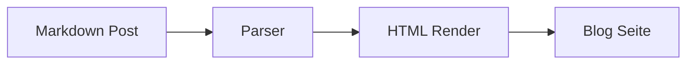

Wenn du Inhalte schnell schreiben willst, ist Markdown genau richtig.

In diesem Post siehst du die wichtigsten Features, die dein Blog jetzt unterstützt.

## 1) Wiki-Links für interne Verweise

Du kannst auf andere Posts mit Wiki-Syntax verlinken:

- [[Zero Downtime Mit Compose]]
- [[Systemd Timer Statt Cron|Systemd statt Cron]]

Das ist praktisch, wenn du beim Schreiben erst mal schnell querverlinken willst.

## 2) Hinweise mit Admonitions

::: note Kontext
Diese Hinweise sind gut für Architektur-Entscheidungen und Trade-offs.
:::

::: tip Praxis
Halte jeden Abschnitt kurz und füge direkt ein lauffähiges Beispiel ein.
:::

::: warning Achtung
Wenn ein Befehl destruktiv ist, immer explizit davor warnen.
:::

## 3) Footnotes für Zusatzinfos

Manche Details stören den Lesefluss im Haupttext und passen besser in eine Fußnote.[^secure-defaults]

[^secure-defaults]: "Secure by default" bedeutet hier: wenig offene Ports, least privilege und nachvollziehbare Deploy-Schritte.

## 4) Mermaid für schnelle Architektur-Skizzen



## 5) Tags für bessere Navigation

Über Frontmatter `tags` kannst du Beiträge thematisch markieren.

Beispiel:

```yaml
tags: Linux, Security, CI
```

So werden die Tags im Post angezeigt und können auch in der Übersicht als Filter genutzt werden.

## Fazit

Wenn du schnell schreiben und trotzdem strukturiert bleiben willst, sind diese Markdown-Features ein sehr guter Mittelweg zwischen Plain Text und vollem CMS.
