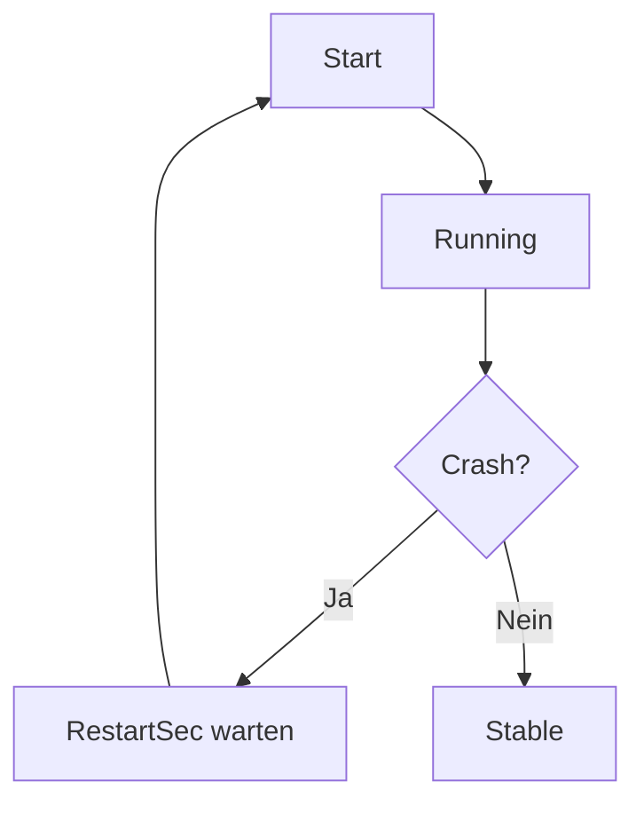

`systemd` ist mehr als nur `systemctl start`.

Wenn Services stabil laufen sollen, helfen ein paar saubere Defaults.

## Beispiel Unit

```ini
[Unit]
Description=Kernel Notes API
After=network-online.target
Wants=network-online.target

[Service]
Type=simple
User=www-data
WorkingDirectory=/opt/kernel-notes
ExecStart=/usr/bin/node server.js
Restart=always
RestartSec=3
Environment=NODE_ENV=production

[Install]
WantedBy=multi-user.target
```

## Restart-Strategie bewusst setzen

- `Restart=always` für langlebige Daemons
- `RestartSec` nutzen, um Crash-Loops zu entschleunigen

::: tip Praxis
Wenn ein Prozess wegen Konfigurationsfehler abstürzt, ist ein kurzer Delay Gold wert für Debugging.
:::

## Logs zentral lesen

```bash
journalctl -u kernel-notes -f
```

Für letzte Fehler:

```bash
journalctl -u kernel-notes -n 200 --no-pager
```

## Healthchecks und Abhängigkeiten

Wenn dein Service externe Abhängigkeiten hat (DB, Cache, API), dokumentiere sie im Unit-File und in Runbooks.

Siehe auch: [[Systemd Timer Statt Cron]]

## Mermaid: Lebenszyklus



## Fazit

Mit sauberem Unit-File, Restart-Strategie und klaren Logs wird `systemd` zum soliden Betriebsfundament statt Blackbox.
