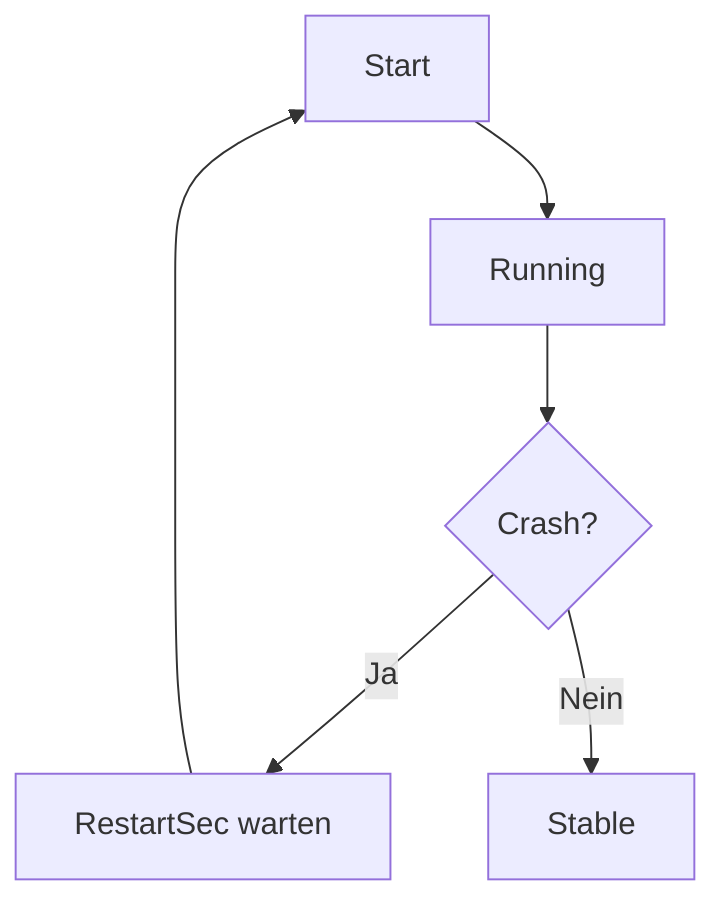

`systemd` ist mehr als nur `systemctl start`.

Wenn Services stabil laufen sollen, helfen ein paar saubere Defaults.

## Beispiel Unit

[Beispiel Unit](/snippets/2026-08-19-systemd-services-sauber-betreiben/01-beispiel-unit.ini "snippet:ini")

## Restart-Strategie bewusst setzen

- `Restart=always` für langlebige Daemons
- `RestartSec` nutzen, um Crash-Loops zu entschleunigen

::: tip Praxis
Wenn ein Prozess wegen Konfigurationsfehler abstürzt, ist ein kurzer Delay Gold wert für Debugging.
:::

## Logs zentral lesen

```bash
journalctl -u kernel-notes -f
```

Für letzte Fehler:

```bash
journalctl -u kernel-notes -n 200 --no-pager
```

## Healthchecks und Abhängigkeiten

Wenn dein Service externe Abhängigkeiten hat (DB, Cache, API), dokumentiere sie im Unit-File und in Runbooks.

Siehe auch: [[fail2ban-ssh-hardening|SSH absichern mit Fail2ban und sauberen Defaults]]

## Mermaid: Lebenszyklus



## Fazit

Mit sauberem Unit-File, Restart-Strategie und klaren Logs wird `systemd` zum soliden Betriebsfundament statt Blackbox.

## Querverweise

- [[fail2ban-ssh-hardening|SSH absichern mit Fail2ban und sauberen Defaults]]
- [[deployment-mit-hetzner-docker-und-cloudflare-zero-trust|Deployment mit Hetzner, Docker und Cloudflare Zero Trust]]

## Quellen

- [systemd.service](/sources.html#systemd-service)
- [journalctl](/sources.html#journalctl)
