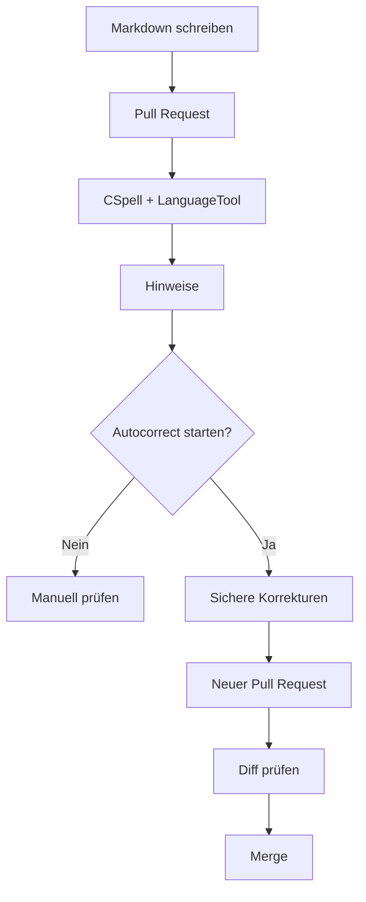

Ich habe Legasthenie und übersehe beim Schreiben regelmäßig Rechtschreib- und Interpunktionsfehler.

Die eigentliche Idee hinter diesem Projekt war aber erstmal deutlich weniger ernst: **Kann man Rechtschreibung eigentlich wie Code behandeln und dafür eine CI/CD-Pipeline bauen?**

Was als kleine Machbarkeitsfrage und Spaßprojekt angefangen hat, funktioniert inzwischen überraschend gut und ist Teil meines Blog-Workflows geworden.

## Die Idee

Meine Blogposts liegen als Markdown in Git. Pull Requests, GitHub Actions und automatisierte Tests waren also ohnehin schon da.

Warum nicht auch die sprachliche Prüfung dort einbauen?

Das Ziel war einfach:

- Fehler automatisch finden,
- Texte nicht ungeprüft von Software verändern lassen,
- Korrekturen im Diff nachvollziehen können.

Daraus ist dieser Ablauf entstanden:



Der wichtigste Punkt: **Prüfen und Ändern sind getrennt.**

## CSpell und LanguageTool

Für die Prüfung nutze ich zwei Werkzeuge.

**CSpell** kümmert sich hauptsächlich um Rechtschreib- und Tippfehler. Bei technischen Texten braucht es eine eigene Wortliste, damit Begriffe wie `Cloudflare`, `Dockerfile`, `Dependabot` oder `DevOps` nicht selbst zum Fehler werden.

**LanguageTool** findet zusätzlich Hinweise zu Grammatik, Interpunktion, Groß- und Kleinschreibung, Typografie und Stil.

Sobald ein Pull Request einen Blogpost ändert, läuft die Proofread-Pipeline. Die Hinweise erscheinen in der GitHub-Action-Summary und als Annotations an den betroffenen Zeilen.


Sprachliche Hinweise sind bewusst **non-blocking**. Ein mögliches Komma soll auffallen, aber nicht denselben Status bekommen wie ein kaputter Test oder ein fehlgeschlagenes Deployment.

## Autokorrektur nur mit Sicherheitsnetz

Die normale Pipeline verändert keinen Text.

Wenn ich Autocorrect nutzen möchte, starte ich dafür einen eigenen GitHub-Action-Workflow manuell.

Automatisch übernommen werden nur möglichst eindeutige Fälle. Bei CSpell muss ein klarer Vorschlag vorhanden sein. Bei LanguageTool werden nur eindeutige `misspelling`-Treffer mit genau einem Ersatz berücksichtigt.

Grammatik, Stil, Typografie und Interpunktion bleiben zur manuellen Prüfung stehen.

Der Workflow schreibt außerdem nie direkt nach `main`. Er erstellt einen Branch und anschließend einen Pull Request.


Im Diff sehe ich dann genau, was verändert wurde.


Zum Beispiel:

```diff
-klein zu halten.
+kleinzuhalten.
```

Wenn eine Änderung falsch aussieht, wird sie nicht gemerged.

Oder anders gesagt: **Autokorrektur als Hilfe, nicht als Autor.**

## Markdown macht es etwas komplizierter

Ein Blogpost besteht nicht nur aus Fließtext. Darin stecken Frontmatter, Codeblöcke, Inline-Code, URLs, Links und technische Bezeichner.

Würde LanguageTool einfach den kompletten Rohtext prüfen, gäbe es entsprechend viele False Positives.

Deshalb maskiert die Integration unter anderem:

```text
Frontmatter
Codeblöcke
Inline-Code
URLs
Markdown-Link-Ziele
HTML
```

Geprüft werden soll möglichst der Text, den ein Leser tatsächlich liest.

## Kurz nachbauen

Im Repository stecken dafür im Kern diese Dateien:

```text
.github/workflows/proofread.yml
.github/workflows/proofread-autocorrect.yml
scripts/spellcheck-posts.js
scripts/proofread-posts.js
cspell.json
config/proofread-words.txt
```

Der Ablauf lässt sich auf fünf Schritte reduzieren:

1. CSpell konfigurieren und technische Begriffe in eine eigene Wortliste aufnehmen.
2. LanguageTool im Workflow starten.
3. Die Prüfung bei Änderungen an `posts/**/*.md` ausführen und Hinweise non-blocking behandeln.
4. Autocorrect nur manuell starten und nur eindeutige Korrekturen anwenden.
5. Änderungen aus Autocorrect immer über einen Pull Request laufen lassen.

Im Alltag sieht das dann ungefähr so aus:

```text
Schreiben
→ Pull Request
→ automatische Prüfung
→ optional Autocorrect
→ Korrektur-PR
→ Diff prüfen
→ Merge
```

## Fazit

Braucht eine Rechtschreibprüfung wirklich GitHub Actions, zwei Tools, eigene Skripte und Pull Requests?

Natürlich nicht.

Das Ganze war in erster Linie ein Spaßprojekt und die Frage, ob sich eine sprachliche Qualitätsprüfung sinnvoll in einen normalen CI/CD-Workflow integrieren lässt.

Die Antwort ist: **Ja.**

Und nebenbei ist daraus etwas entstanden, das mir tatsächlich hilft. Die Technik findet Fehler, die ich selbst leicht übersehe, ohne mir die Entscheidung über den finalen Text abzunehmen.

Ein bisschen Overengineering war also durchaus Absicht.

## Querverweise

- [[wie-dieser-blog-gebaut-ist|Wie dieser Blog gebaut ist]]
- [[dependabot-im-einsatz|Dependabot im Einsatz]]

## Quellen

- [CSpell Dokumentation](/sources.html#cspell)
- [LanguageTool HTTP Server](/sources.html#languagetool-http-server)
- [GitHub Actions](/sources.html#github-actions-docs)
- [Manuell gestartete GitHub-Actions-Workflows](/sources.html#github-actions-manual-workflows)
