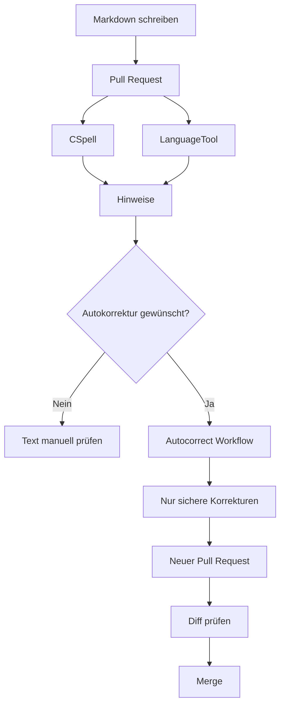
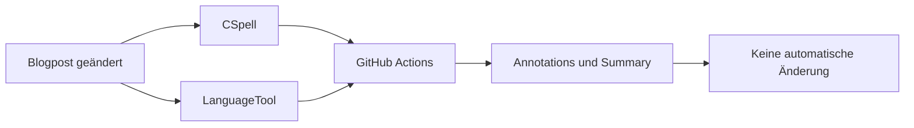
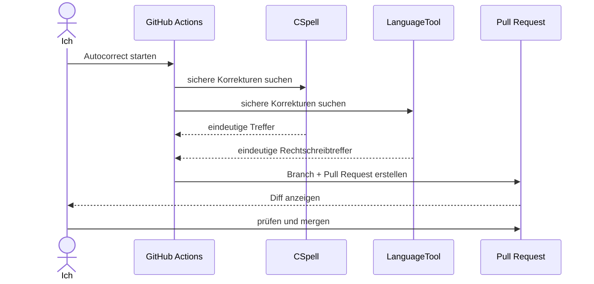

Ich habe Legasthenie. Beim Schreiben bedeutet das für mich ganz praktisch: Rechtschreibfehler, vertauschte Buchstaben und Fehler bei der Interpunktion passieren regelmäßig. Besonders bei längeren technischen Texten übersehe ich sie beim eigenen Korrekturlesen schnell.

Ich möchte deshalb nicht weniger schreiben. Ich möchte Technik nutzen, um trotzdem möglichst **fehlerarme Texte** zu veröffentlichen.

Das ist inzwischen ein Teil dieses Blogs geworden. Und weil mich Automatisierung interessiert, ist die Lösung ein kleines bisschen over-engineered.

## Das Ziel

Ich wollte drei Dinge:

- Fehler automatisch finden.
- Texte nicht ungeprüft durch Software verändern lassen.
- Korrekturen genauso nachvollziehbar behandeln wie Code.

Daraus ist diese Pipeline entstanden:



Der wichtigste Punkt ist die Trennung zwischen **prüfen** und **ändern**.

Die normale Pipeline darf Fehler melden. Sie darf meinen Text aber nicht einfach umschreiben.

## Zwei Werkzeuge, zwei Aufgaben

Für die Prüfung nutze ich **CSpell** und **LanguageTool**.

CSpell kümmert sich hauptsächlich um klassische Rechtschreib- und Tippfehler. Bei technischen Texten braucht es zusätzlich eine eigene Wortliste, sonst werden Begriffe wie `Cloudflare`, `Dockerfile`, `Dependabot` oder `DevOps` schnell selbst zum vermeintlichen Fehler.

LanguageTool geht weiter und findet zusätzlich Hinweise zu Grammatik, Interpunktion, Groß- und Kleinschreibung, Typografie und Stil.

Das heißt aber nicht, dass alle Vorschläge automatisch übernommen werden.

## Die normale Proofread-Pipeline verändert nichts

Sobald ein Pull Request einen Blogpost ändert, läuft die Proofread-Pipeline.



Sprachliche Hinweise sind dabei bewusst **non-blocking**. Ein möglicher Kommafehler soll mir auffallen, aber nicht denselben Status haben wie ein kaputter Test oder ein fehlgeschlagenes Deployment.

Der Workflow schreibt die Ergebnisse direkt in die GitHub-Action-Summary und als Annotations an die betroffenen Zeilen.


In diesem Lauf wurden 11 Dateien geprüft. LanguageTool hat 22 Hinweise gefunden, aber nur eine Korrektur wurde automatisch als sicher eingestuft. Genau das ist gewollt: viele Hinweise, wenige automatische Änderungen.

## Warum nicht einfach alles automatisch korrigieren?

Weil Autokorrektur selbst Fehler erzeugen kann.

Ein Rechtschreibvorschlag kann technisch eindeutig aussehen und trotzdem im Satz falsch sein. Deshalb gelten für die automatische Korrektur enge Regeln.

Für CSpell gilt im Wesentlichen:

```text
kein eindeutiger Vorschlag
→ nichts ändern

genau ein eindeutiger Vorschlag
→ Korrektur möglich

mehrere Vorschläge
→ nichts ändern
```

LanguageTool ist noch restriktiver. Automatisch übernommen werden nur eindeutige Treffer vom Typ `misspelling` mit genau einem Ersatz. Grammatik-, Stil-, Typografie- und Interpunktionshinweise bleiben zur manuellen Prüfung stehen.

Das ist der Unterschied zwischen **Autokorrektur als Hilfe** und **Autokorrektur als Autor**.

## Autokorrektur läuft bewusst manuell

Die eigentliche Autokorrektur startet nicht bei jedem Commit. Sie wird in GitHub Actions bewusst manuell ausgelöst.


Dabei kann ich optional nur einen bestimmten Markdown-Post angeben. Bleibt das Feld leer, werden alle aktiven Posts geprüft.

Der Ablauf ist dann:



Der Workflow schreibt also nicht direkt nach `main`.

Er erzeugt einen eigenen Branch und danach einen Pull Request.


Damit bleibt jede automatische Textänderung nachvollziehbar und überprüfbar.

## Der Diff ist die eigentliche Sicherheitsstufe

Im Pull Request sehe ich genau, was die Automatik verändert hat.


Im gezeigten Lauf wurde beispielsweise:

```diff
-klein zu halten.
+kleinzuhalten.
```

korrigiert.

Das ist genau die Art von Änderung, die ich automatisieren möchte: klein, nachvollziehbar und im Diff sofort verständlich.

Wenn eine Änderung falsch aussieht, wird sie nicht gemerged.

## Markdown muss teilweise ausgeblendet werden

Ein Blogpost besteht nicht nur aus Fließtext. Darin stecken auch Frontmatter, Codeblöcke, Inline-Code, URLs, Markdown-Links und technische Bezeichner.

Eine Rechtschreibprüfung auf dem kompletten Rohtext würde deshalb viele False Positives erzeugen.

Die LanguageTool-Integration maskiert unter anderem:

```text
Frontmatter
Codeblöcke
Inline-Code
URLs
Markdown-Link-Ziele
HTML
```

So wird möglichst der Text geprüft, den ein Leser tatsächlich liest, und nicht jede technische Zeichenfolge im Dokument.

## Warum dieser Aufwand?

Natürlich könnte ich jeden Artikel vor dem Veröffentlichen durch einen normalen Texteditor schicken.

Aber meine Texte liegen als Markdown in Git, Pull Requests sind bereits Teil des Workflows und GitHub Actions übernimmt ohnehin Tests und Deployment. Deshalb soll auch die sprachliche Qualitätsprüfung dort stattfinden.

Der Kern für mich ist:

**Fehlerarme Texte trotz Legasthenie schreiben, ohne das Schreiben selbst an eine Automatik abzugeben.**

Die Technik unterstützt dort, wo ich Fehler regelmäßig übersehe. Die Entscheidung über den finalen Text bleibt bei mir.

Und der zweite Grund ist einfacher: Ich finde solche Systeme interessant.

Eine Rechtschreibprüfung hätte man deutlich kleiner bauen können. Dafür hätte ich dann aber weniger über GitHub Actions, Workflow Permissions, LanguageTool, CSpell, Markdown-Masking und Pull-Request-Automation gelernt.

Ein bisschen Overengineering gehört hier also dazu.

## Fazit

Der Ablauf ist bewusst simpel gehalten:

```text
Schreiben
↓
automatisch prüfen
↓
Hinweise bekommen
↓
optional Autocorrect manuell starten
↓
sichere Änderungen als Pull Request
↓
Diff kontrollieren
↓
veröffentlichen
```

Die Pipeline soll Fehler früh finden und mir Arbeit abnehmen. Sie soll aber nicht entscheiden, was ich geschrieben haben wollte.

Für mich ist das die passende Mischung aus Accessibility und Engineering: **Technik reduziert die Fehlerquote, der Mensch behält die Kontrolle.**
