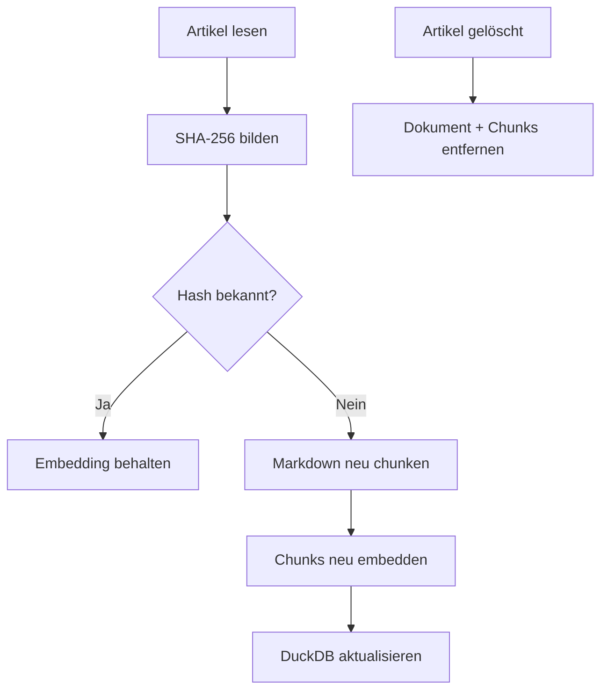
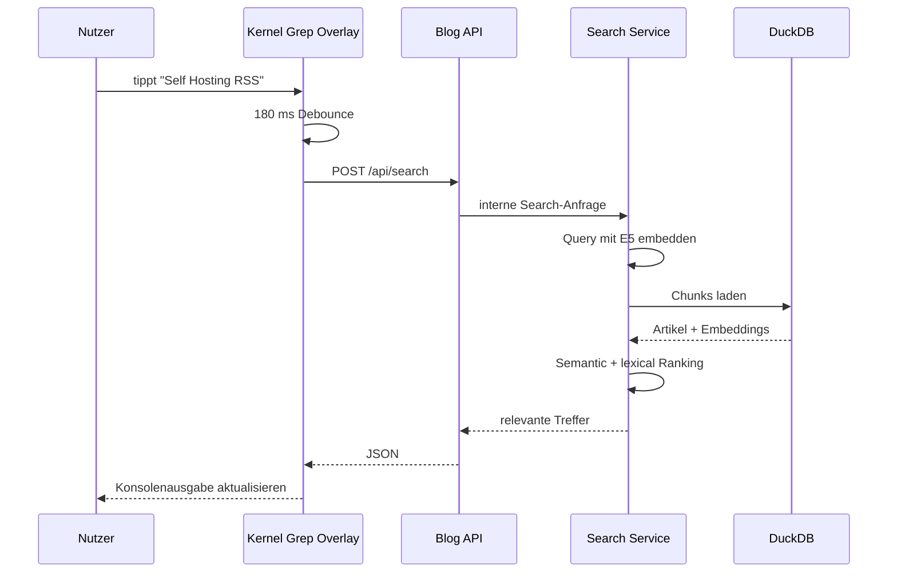
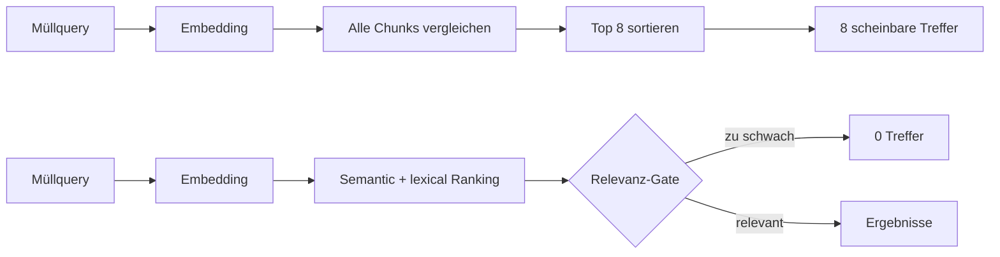
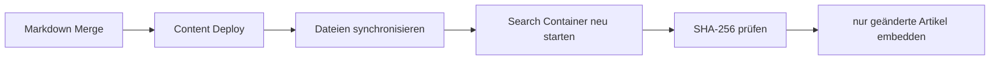

Eine normale Volltextsuche ist simpel: Ich tippe `Docker` ein und bekomme Texte zurück, in denen `Docker` vorkommt.

Spannender wird es bei einer Suche wie:

```text
Wie komme ich ohne öffentliche IP auf einen Server?
```

Der passende Artikel muss diesen Satz nicht exakt enthalten. Trotzdem möchte ich genau dort landen, wo es um private Systeme, Session Manager, Bastion Hosts oder ähnliche Themen geht.

Dafür habe ich **Kernel Grep** gebaut: eine lokale semantische Suche für Kernel Notes. Sie läuft auf meinem eigenen Host, durchsucht die Markdown-Artikel mit Embeddings und zeigt die Ergebnisse entweder auf `/grep` oder als Spotlight-artige Konsole über `⌘K` beziehungsweise `Ctrl+K` direkt über jeder Seite.


Der interessante Teil war am Ende nicht das erste Embedding. Der interessante Teil war alles danach: Chunking, Datenhaltung, Ranking, Live-Suche, Deployment und vor allem die Frage, wann eine semantische Ähnlichkeit **wirklich ein Treffer** ist.

## Die Inspiration

Der Ausgangspunkt war ein Artikel von Simon Späti über ein lokales RAG für Obsidian mit DuckDB. Dort werden Markdown-Dateien in Chunks zerlegt, eingebettet und semantisch durchsucht. Später kommen Graph-Beziehungen und eine Weboberfläche dazu.

Das Grundprinzip fand ich passend für meinen Blog. Ich wollte aber bewusst kleiner anfangen.

Kein MotherDuck. Kein Neo4j. Kein Kafka. Kein LLM-Chat.

Erst einmal nur die Frage:

> Kann ich meine vorhandenen Markdown-Artikel lokal so indexieren, dass eine semantische Suche zuverlässig brauchbare Treffer liefert?

Das war die erste wichtige Entscheidung. **Retrieval zuerst. Alles andere später.**

## Die heutige Architektur

```mermaid
flowchart LR
    A[posts/*.md] --> B[Markdown-aware Chunker]
    B --> C[passage: Text]
    C --> D[multilingual-e5-small]
    D --> E[Embeddings]
    E --> F[(DuckDB)]

    Q[Suchanfrage] --> R[query: Text]
    R --> S[multilingual-e5-small]
    S --> T[Query Embedding]

    F --> U[SemanticSearchEngine]
    T --> U
    U --> V[Hybrid Ranking]
    V --> W[Kernel Grep Service :8090]
    W --> X[Blog /api/search]
    X --> Y[/grep + Console Overlay]
```

Der Blogprozess selbst führt das Embedding-Modell nicht aus. Dafür gibt es einen eigenen internen Search-Container.

```text
Browser
  -> POST /api/search
  -> Blog Container
  -> internes Docker-Netz
  -> Kernel Grep Container
  -> DuckDB + lokales E5-Modell
```

Der Search-Container veröffentlicht keinen eigenen Host-Port. Die Browseranfrage bleibt am Blog und wird intern weitergereicht.

Das macht zwei Dinge einfacher: Der eigentliche Blog bleibt schlank und der Search-Service kann sein Modell, seinen Cache und DuckDB unabhängig verwalten.

## Warum DuckDB?

Für den aktuellen Umfang brauche ich keinen eigenen Vector-Database-Cluster.

DuckDB passt gut, weil ich Metadaten und Vektoren in einer lokalen Datei halten kann. Der offizielle Node-Client `@duckdb/node-api` arbeitet Promise-basiert und lässt sich direkt in den bestehenden Node-Stack integrieren.

Die beiden Tabellen sind bewusst unspektakulär:

```sql
CREATE TABLE rag_documents (
    post_id VARCHAR PRIMARY KEY,
    slug VARCHAR NOT NULL,
    title VARCHAR NOT NULL,
    source_hash VARCHAR NOT NULL,
    indexed_at TIMESTAMP NOT NULL
);

CREATE TABLE rag_chunks (
    chunk_id VARCHAR PRIMARY KEY,
    post_id VARCHAR NOT NULL,
    heading VARCHAR,
    content VARCHAR NOT NULL,
    embedding_model VARCHAR NOT NULL,
    embedding FLOAT[] NOT NULL
);
```

Für die aktuelle Artikelmenge brauche ich noch keinen HNSW-Index. Die Chunks werden geladen und per Cosine Similarity im Node-Prozess verglichen. Wenn der Bestand irgendwann groß genug wird, kann DuckDB-VSS später dazukommen.

## Markdown nicht einfach irgendwo durchschneiden

Der erste Indexer nimmt nicht den kompletten Artikel als einen einzigen Vektor.

Ein längerer Artikel enthält mehrere Themen. Würde ich alles als einen Vektor speichern, verliert die Suche viel Kontext. Deshalb zerlege ich Markdown anhand von Überschriften und Absätzen in kleinere Chunks.

Wichtig war mir dabei: **Codeblöcke dürfen nicht mitten drin zerschnitten werden.**

Vereinfacht sieht der Chunker so aus:

```js
for (const line of lines) {
  const fenceMatch = line.match(/^\s*(```+|~~~+)/);

  if (fenceMatch) {
    // Fence öffnen oder schließen.
    // Innerhalb eines Fence werden Überschriften ignoriert.
    body.push(line);
    continue;
  }

  if (!fence) {
    const heading = line.match(/^(#{1,4})\s+(.+?)\s*$/);
    if (heading) {
      flush();
      currentHeading = heading[2];
      continue;
    }
  }

  body.push(line);
}
```

Ein Chunk bekommt anschließend nicht nur den Fließtext. Titel und Abschnitt werden als Kontext vorangestellt:

```js
function embeddingText({ title, heading, content }) {
  return [title, heading, content]
    .filter(Boolean)
    .join('\n\n');
}
```

Das Ergebnis sieht ungefähr so aus:

```text
RSS ist nicht tot – FreshRSS als Self-Hosting-Empfehlung

Self-Hosting statt Cloud-Dienst

Natürlich gibt es zahlreiche gehostete RSS Reader ...
```

Der Titel bleibt damit auch dann Teil des semantischen Signals, wenn der eigentliche Chunk weit unten im Artikel liegt.

## Embeddings lokal mit E5

Als Modell läuft aktuell `Xenova/multilingual-e5-small` über Transformers.js.

Ich wollte bewusst ein mehrsprachiges Modell, weil die Artikel zwar überwiegend deutsch sind, technische Begriffe aber ständig Englisch enthalten.

Die Implementierung ist klein:

```js
const { env, pipeline } = await import('@huggingface/transformers');

env.cacheDir = cacheDir;

const extractor = await pipeline(
  'feature-extraction',
  'Xenova/multilingual-e5-small',
  { dtype: 'q8' }
);

const output = await extractor(values, {
  pooling: 'mean',
  normalize: true
});
```

Bei E5 ist noch ein Detail wichtig: Queries und Dokumente bekommen unterschiedliche Prefixe.

```js
embedDocuments(texts) {
  return embed(texts, 'passage: ');
}

embedQuery(text) {
  return embed([text], 'query: ');
}
```

Das steht nicht nur aus optischen Gründen im Code. Das Modell wurde so trainiert. Ohne `query:` und `passage:` verschlechtert sich das Retrieval.

## Inkrementell statt jedes Mal alles neu

Embeddings kosten mehr als ein Markdown-Parse. Deshalb wollte ich beim Content-Deploy nicht jedes Mal den kompletten Blog neu einbetten.

Jeder Artikel bekommt einen SHA-256-Hash des Quelltexts.



Im Indexer ist die Entscheidung entsprechend einfach:

```js
const unchanged = state
  && state.source_hash === document.sourceHash
  && state.embedding_model === options.model
  && Number(state.chunk_count) > 0;

if (unchanged && !options.force) {
  continue;
}
```

Das passt inzwischen auch zum Deployment: Ein reiner Content-Deploy baut keine Docker-Images neu. Die Markdown-Dateien werden synchronisiert, der Search-Container startet neu und berechnet nur das, was sich tatsächlich verändert hat.

## Von der Eingabe bis zum Treffer

Die Suche soll sich nicht wie ein Formular anfühlen. Sobald ich tippe, sollen Ergebnisse auftauchen.



Im Browser läuft dafür ein Debounce von 180 Millisekunden. Gleichzeitig wird eine alte Anfrage abgebrochen, sobald eine neue Eingabe relevanter ist.

```js
const DEBOUNCE_MS = 180;
let activeController = null;

async function search(query) {
  activeController?.abort();

  const controller = new AbortController();
  activeController = controller;

  const response = await fetch('/api/search', {
    method: 'POST',
    headers: { 'Content-Type': 'application/json' },
    body: JSON.stringify({ q: query, limit: 6 }),
    signal: controller.signal
  });
}
```

Das verhindert einen typischen Live-Search-Fehler: Eine ältere, langsamere Anfrage darf nicht später eintreffen und die Ergebnisse einer neueren Query überschreiben.

## Der größte Denkfehler: Vector Search liefert immer irgendwas

Die erste Version hat technisch funktioniert und war trotzdem falsch.

Ich konnte so etwas eingeben:

```text
aksdfnasdglvhnasdf
```

und bekam acht Artikel zurück.

Warum?

Weil eine Vektorsuche immer Abstände vergleichen kann. Wenn ich sage „gib mir die acht besten“, bekomme ich acht Ergebnisse – selbst wenn alle schlecht sind.



Das war der Punkt, an dem aus einer reinen Vector Search ein **hybrides Ranking** wurde.

## Semantik allein reicht nicht

Heute berechne ich zusätzlich einen lexikalischen Score. Treffer in Titel oder Tags sind stärker als ein zufälliges Wort tief im Artikel.

```js
const fields = [
  [chunk.title, 1.0],
  [chunk.tags, 0.9],
  [chunk.heading, 0.75],
  [chunk.category, 0.65],
  [chunk.excerpt, 0.55],
  [chunk.content, 0.4]
];
```

Der kombinierte Chunk-Score ist aktuell:

```js
const chunkRankScore = semanticScore
  + (lexicalScore * 0.12);
```

Danach kommt ein Relevanz-Gate. Ein Artikel muss entweder genügend echte Wort-Evidenz besitzen oder semantisch klar über dem restlichen Index liegen.

```js
const DEFAULT_RELEVANCE = {
  minSemanticScore: 0.84,
  minSemanticLift: 0.025,
  minLexicalScore: 0.22,
  lexicalBoost: 0.12
};

const semanticQualified =
  candidate.semanticScore >= minSemanticScore
  && semanticLift >= minSemanticLift;

const relevant = lexicalQualified || semanticQualified;
```

`semanticLift` ist dabei der Abstand zum Median der übrigen Artikel. Ein hoher absoluter Wert allein reicht also nicht.

Das ist gerade bei E5 wichtig. Die Modellkarte weist ausdrücklich darauf hin, dass Cosine-Similarities bei E5 häufig relativ hoch liegen und die **Reihenfolge** wichtiger ist als eine Interpretation als Prozentwert.

## Fehlversuch Nummer zwei: 83 % sah aus wie eine Wahrscheinlichkeit

Die erste Oberfläche zeigte den rohen Cosine-Score ungefähr so an:

```text
83%
```

Das sah aus wie:

> Dieser Artikel passt mit 83 Prozent Wahrscheinlichkeit.

Genau das sagt der Wert aber nicht.

Es war nur die Ähnlichkeit zweier normalisierter Vektoren. Deshalb ist die Prozentanzeige wieder verschwunden. Das Ranking darf intern mit solchen Werten arbeiten, die Oberfläche sollte daraus aber keine Scheingenauigkeit bauen.

## Fehlversuch Nummer drei: FLOAT[] war nicht so banal wie gedacht

Ein weiterer Fehler war deutlich technischer.

Die Embeddings waren vor dem Schreiben korrekt. Nach dem Lesen aus DuckDB kamen bei normalisierten Fließkomma-Vektoren aber falsche Werte zurück. Die ersten Tests hatten das nicht entdeckt, weil sie nur mit sehr einfachen `0`- und `1`-Vektoren gearbeitet hatten.

Die Lösung war, beim Parameter-Binding nicht auf Typinferenz zu vertrauen:

```js
const values = {
  embedding: duckdb.listValue(chunk.embedding)
};

const types = {
  embedding: duckdb.LIST(duckdb.FLOAT)
};

await connection.run(sql, values, types);
```

Seitdem gibt es einen Roundtrip-Test, der normalisierte Embeddings vor und nach DuckDB miteinander vergleicht.

Das war eine gute Erinnerung daran, dass ein Test mit unrealistisch einfachen Daten sehr beruhigend grün sein kann.

## Fehlversuch Nummer vier: UI und Backend waren kurz nicht auf demselben Stand

Die Live-Suche wurde irgendwann von GET auf POST umgestellt, damit die Suchphrase nicht unnötig in der öffentlichen URL steht.

Der Browser machte also:

```http
POST /api/search
Content-Type: application/json

{"q":"Docker","limit":6}
```

Der Production-Smoke-Test prüfte aber noch:

```text
GET /api/search?q=Docker
```

Damit konnte der Deployment-Test grün sein, obwohl die echte UI auf dem laufenden System einen `HTTP 404` bekam.

Der Smoke-Test prüft inzwischen bewusst den gleichen Pfad wie der Browser – inklusive einer Müllquery, die **keine Ergebnisse** liefern darf.

```bash
curl -X POST \
  -H 'Content-Type: application/json' \
  --data '{"q":"Docker","limit":1}' \
  http://127.0.0.1:1888/api/search

curl -X POST \
  -H 'Content-Type: application/json' \
  --data '{"q":"aksdfnasdglvhnasdf","limit":8}' \
  http://127.0.0.1:1888/api/search
```

Die zweite Antwort muss `"results":[]` enthalten. Sonst gilt das Deployment als fehlerhaft.

## Fehlversuch Nummer fünf: Funktioniert, sieht aber schlecht aus

Die erste `/grep`-Seite war viel zu groß, dunkel und dekorativ. Überschrift und Ergebnisse hatten auf dem hellen Bloghintergrund teilweise zu wenig Kontrast.

Technisch lief die Suche. Visuell wirkte sie trotzdem wie ein Fremdkörper.

Daraufhin habe ich die Vollansicht zurückgebaut und die eigentliche Idee stärker in die Navigation verlagert: ein kleiner `grep…`-Trigger öffnet eine Spotlight-artige Konsole über der aktuellen Seite.

Die Ausgabe sieht bewusst nicht wie eine typische Search-Card aus:

```text
$ grep --semantic "Docker Compose" posts/
3 matches · 92 ms

[01] ./posts/docker-hetzner#deployment
> Docker + Hetzner + Cloudflare Zero Trust
  ...

[02] ./posts/...
> ...
```

Öffnen geht per Navigation, `⌘K` beziehungsweise `Ctrl+K`. Mit `Esc` verschwindet das Overlay wieder.

## Warum kein MotherDuck?

MotherDuck wäre eine mögliche Cloud-Schicht für DuckDB. Für meine aktuelle Architektur bringt sie aber wenig.

Ich habe einen Blog, einen Search-Service und einen Host. Die Datenbank kann deshalb schlicht als persistente DuckDB-Datei neben dem Search-Container liegen.

MotherDuck würde zusätzliche Infrastruktur und einen weiteren Datenverarbeiter einführen, ohne dass ich aktuell horizontale Skalierung oder einen gemeinsam genutzten Cloud-Datenbestand brauche.

## Warum noch kein Neo4j?

Neo4j finde ich weiterhin interessant – aber für einen anderen Teil des Problems.

DuckDB beantwortet aktuell:

> Welche Chunks sind semantisch ähnlich zu meiner Query?

Neo4j wäre später interessant für:

```text
Artikel -> Tag -> Artikel
Artikel -> verlinkt auf -> Artikel
Artikel -> ähnlich zu -> Artikel
Artikel -> Thema -> Artikel
```

Damit ließen sich Multi-Hop-Beziehungen und echtes GraphRAG bauen. Der bestehende Knowledge Graph ist dafür ein guter Kandidat.

Aber: Erst wenn das Retrieval stabil ist, lohnt sich die zusätzliche Datenbank.

## Und Kafka?

Kafka wäre momentan reines Overengineering.

Der aktuelle Content-Flow ist klein:



Dafür brauche ich keinen Event-Streaming-Cluster.

Kafka wird erst interessant, wenn irgendwann mehrere unabhängige Consumer gleichzeitig auf Events wie `article.published` reagieren sollen.

## Datenschutz war Teil der Architektur

Kernel Grep schickt Suchanfragen nicht an einen externen LLM- oder Embedding-Dienst.

Das Modell läuft im Search-Container. DuckDB liegt lokal. Der Browser spricht ausschließlich mit `/api/search` auf derselben Website und der Blog proxyt intern weiter.

Das ist für mich nicht nur eine Datenschutzentscheidung, sondern hält auch die Architektur verständlich.

```text
Browser -> eigener Blog -> eigener Search-Service
```

statt:

```text
Browser -> Blog -> externe Embedding API -> externe Vector DB -> ...
```

## Was als Nächstes kommt

Die Suche ist für mich jetzt an dem Punkt, an dem die Basis sinnvoll funktioniert. Der nächste logische Schritt ist nicht sofort ein Chatbot.

Interessanter finde ich zunächst, die semantischen Beziehungen in den bestehenden Knowledge Graph zu übernehmen.

Dann könnten Artikel nicht nur über Tags und Kategorien verbunden sein, sondern auch über echte inhaltliche Ähnlichkeit.

Danach wird Neo4j wieder interessant. Und erst wenn Retrieval und Graph sauber genug sind, kommt ein mögliches LLM darüber.

Die Reihenfolge bleibt also:

```text
Search
  -> bessere Relevanz
  -> semantische Graph-Kanten
  -> Graph-Abfragen
  -> eventuell RAG-Antworten mit Quellen
```

Kafka darf noch etwas warten.

## Quellen

Die wichtigsten technischen und konzeptionellen Quellen für den Aufbau waren:

- [Building an Obsidian RAG with DuckDB and MotherDuck – ssp.sh](https://www.ssp.sh/blog/obsidian-rag-duckdb-sql/)
- [Search – ssp.sh](https://www.ssp.sh/search/)
- [DuckDB Node.js Client (Neo)](https://duckdb.org/docs/stable/clients/node_neo/overview)
- [Transformers.js Pipeline API](https://huggingface.co/docs/transformers.js/en/pipelines)
- [multilingual-e5-small Model Card](https://huggingface.co/intfloat/multilingual-e5-small)
- [Text Embeddings by Weakly-Supervised Contrastive Pre-training](https://arxiv.org/abs/2212.03533)

Der wichtigste Teil kam aber erst beim Benutzen: Eine Suche ist nicht dann fertig, wenn sie Ergebnisse liefert. Sie ist erst brauchbar, wenn sie auch zuverlässig sagen kann: **Dazu habe ich nichts Passendes.**
