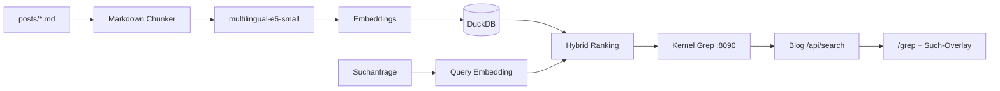

Eine normale Volltextsuche ist gut darin, Wörter wiederzufinden. Ich tippe `Docker` ein und bekomme Artikel zurück, in denen `Docker` steht.

Interessanter wird eine Frage wie:

```text
Wie komme ich ohne öffentliche IP auf einen Server?
```

Der passende Artikel muss diesen Satz nicht enthalten. Er kann stattdessen über Session Manager, private EC2-Instanzen oder Bastion Hosts sprechen. Genau dafür habe ich **Kernel Grep** gebaut: eine lokale semantische Suche für Kernel Notes.


Die Suche läuft auf meinem eigenen Host. Sie indexiert die Markdown-Artikel, erzeugt Embeddings und liefert Ergebnisse über `/grep` sowie über die Suche mit `⌘K` beziehungsweise `Ctrl+K`.

Der schwierige Teil war nicht, ein Embedding-Modell aufzurufen. Schwieriger war es, aus den Ähnlichkeitswerten eine Suche zu bauen, die auch **keinen Treffer** zurückgeben kann.

## Bewusst klein anfangen

Die Grundidee kam aus dem Umfeld lokaler RAG-Systeme für Markdown und Obsidian. Für meinen Blog wollte ich aber nicht sofort einen großen Stack aufziehen.

Kein Kafka, kein Neo4j, kein GraphRAG, kein LLM-Chat und kein eigener Vector-Database-Cluster. Für ein paar Blogartikel wäre das vor allem zusätzliche Infrastruktur gewesen.

Mein erstes Ziel war kleiner:

> Markdown sinnvoll zerlegen, lokal einbetten und zuverlässig die passenden Artikel finden.

## Architektur

Die Suche läuft getrennt vom eigentlichen Blogprozess.



Der Browser spricht nur mit dem Blog:

```text
Browser
  -> POST /api/search
  -> Blog Container
  -> internes Docker-Netz
  -> Search Container
  -> DuckDB + E5
```

Der Search-Container hat keinen öffentlichen Host-Port. Dadurch bleibt das Modell intern und der Blog kann unabhängig davon ausgeliefert werden.

## Warum DuckDB reicht

Für die aktuelle Datenmenge ist eine lokale DuckDB-Datei völlig ausreichend. Darin liegen die Artikel-Metadaten und die Vektoren der einzelnen Textabschnitte.

Vereinfacht brauche ich zwei Arten von Daten:

```sql
CREATE TABLE rag_documents (
    post_id VARCHAR PRIMARY KEY,
    slug VARCHAR NOT NULL,
    title VARCHAR NOT NULL,
    source_hash VARCHAR NOT NULL
);

CREATE TABLE rag_chunks (
    chunk_id VARCHAR PRIMARY KEY,
    post_id VARCHAR NOT NULL,
    heading VARCHAR,
    content VARCHAR NOT NULL,
    embedding FLOAT[] NOT NULL
);
```

Einen HNSW-Index brauche ich bei der aktuellen Menge ebenfalls noch nicht. Die Chunks werden geladen und im Node-Prozess per Cosine Similarity verglichen. Wenn der Datenbestand irgendwann deutlich größer wird, kann ich die Suche immer noch anders skalieren.

## Markdown wird in Abschnitte zerlegt

Ein kompletter Artikel als einzelner Vektor wäre zu grob. Ein längerer Beitrag kann gleichzeitig über Docker, Deployment, Security und Monitoring sprechen. Deshalb wird Markdown anhand von Überschriften und Absätzen in Chunks zerlegt.

Codeblöcke bleiben dabei zusammen. Eine Markdown-Überschrift innerhalb eines Code-Fences darf den Text beispielsweise nicht versehentlich teilen.

Für das Embedding bekommt jeder Chunk zusätzlich Titel und Abschnittsüberschrift als Kontext:

```js
function embeddingText({ title, heading, content }) {
  return [title, heading, content]
    .filter(Boolean)
    .join('\n\n');
}
```

Damit bleibt der Zusammenhang zum Artikel erhalten, auch wenn ein Treffer aus einem Abschnitt weit unten im Text stammt.

## Lokale Embeddings mit E5

Als Modell läuft `Xenova/multilingual-e5-small` über Transformers.js. Das Modell ist mehrsprachig, was für deutsche Texte mit vielen englischen Fachbegriffen gut passt.

E5 erwartet unterschiedliche Prefixe für Dokumente und Suchanfragen:

```js
embedDocuments(texts) {
  return embed(texts, 'passage: ');
}

embedQuery(text) {
  return embed([text], 'query: ');
}
```

Das ist Teil der vorgesehenen Nutzung des Modells und nicht nur Formatierung.

Die Embeddings werden außerdem nicht bei jedem Start komplett neu berechnet. Jeder Artikel bekommt einen Hash seines Quelltexts. Ist Hash und Modell unverändert, bleiben die vorhandenen Chunks bestehen. Geänderte Artikel werden neu indexiert, gelöschte Artikel aus DuckDB entfernt.

## Der entscheidende Teil: Relevanz

Die erste Version der Vector Search hatte ein grundsätzliches Problem: Selbst eine offensichtlich unsinnige Zeichenfolge bekam Ergebnisse.

Das ist technisch logisch: Wenn ich alle Vektoren nach Ähnlichkeit sortiere und anschließend die besten acht nehme, gibt es immer acht "beste" Kandidaten. Das bedeutet aber nicht, dass einer davon gut ist.

Deshalb ist Kernel Grep heute keine reine Vector Search mehr. Zusätzlich zum semantischen Score gibt es einen lexikalischen Score. Ein Treffer im Titel zählt stärker als ein Wort irgendwo tief im Fließtext:

```js
const fields = [
  [chunk.title, 1.0],
  [chunk.tags, 0.9],
  [chunk.heading, 0.75],
  [chunk.category, 0.65],
  [chunk.excerpt, 0.55],
  [chunk.content, 0.4]
];
```

Beide Signale werden kombiniert:

```js
const chunkRankScore = semanticScore
  + (lexicalScore * 0.12);
```

Danach entscheidet ein Relevanz-Gate, ob ein Kandidat überhaupt angezeigt wird. Aktuell gelten unter anderem diese Grenzen:

```js
const DEFAULT_RELEVANCE = {
  minSemanticScore: 0.84,
  minSemanticLift: 0.025,
  minLexicalScore: 0.22,
  lexicalBoost: 0.12
};
```

`semanticLift` vergleicht einen Kandidaten mit dem Median der übrigen Artikel. Ein hoher Cosine-Similarity-Wert reicht also nicht allein; der Treffer muss sich auch vom restlichen Index abheben oder lexikalisch überzeugend sein.

Das ist für mich der wichtigste Teil der gesamten Suche: **Top-K ist noch keine Relevanzentscheidung.**

## Drei Fehler, die dabei wirklich geholfen haben

Ein paar Fehler waren nützlicher als jede theoretische Planung.

### Cosine Similarity ist keine Wahrscheinlichkeit

Die erste Oberfläche zeigte Werte wie `83 %`. Das sah so aus, als würde ein Artikel mit 83 Prozent Wahrscheinlichkeit zur Anfrage passen.

Das stimmt nicht. Der Wert beschreibt die Ähnlichkeit der Vektoren. Deshalb zeigt die Oberfläche heute keine Prozentzahl mehr. Intern bleibt der Score für das Ranking nützlich, aber er wird nicht als Scheingenauigkeit an den Nutzer verkauft.

### DuckDB brauchte einen expliziten Typ

Beim Schreiben der Embeddings in `FLOAT[]` waren die Werte korrekt, nach dem Lesen aber teilweise falsch. Ursache war das Parameter Binding.

Die Lösung war, den Typ ausdrücklich anzugeben:

```js
const values = {
  embedding: duckdb.listValue(chunk.embedding)
};

const types = {
  embedding: duckdb.LIST(duckdb.FLOAT)
};

await connection.run(sql, values, types);
```

Seitdem prüft ein Roundtrip-Test echte normalisierte Fließkomma-Vektoren statt nur einfache Testwerte aus Nullen und Einsen.

### Frontend und API müssen gemeinsam getestet werden

Die Suche wurde von GET auf POST umgestellt. Kurzzeitig war die API bereits geändert, während ein Client noch das alte Verhalten erwartete.

Das war kein Problem der semantischen Suche, sondern ein klassischer Integrationsfehler. Seitdem gehören die Browser-Smoke-Tests und die API-Tests für mich genauso zur Suche wie das Ranking selbst.

## Live-Suche im Browser

Die Oberfläche wartet nicht auf einen Submit-Button. Nach kurzer Verzögerung wird die aktuelle Eingabe gesucht. Läuft noch eine ältere Anfrage, wird sie abgebrochen.

```js
const DEBOUNCE_MS = 180;
let activeController = null;

async function search(query) {
  activeController?.abort();

  const controller = new AbortController();
  activeController = controller;

  return fetch('/api/search', {
    method: 'POST',
    headers: { 'Content-Type': 'application/json' },
    body: JSON.stringify({ q: query, limit: 6 }),
    signal: controller.signal
  });
}
```

Damit kann eine alte, langsame Anfrage nicht nachträglich die Ergebnisse einer neueren Suche überschreiben.

## Deployment

Blog und Search-Service laufen als getrennte Container. Das Modell und sein Cache liegen beim Search-Service, während der Blog die API nur intern weiterleitet.

Bei Content-Änderungen werden die Markdown-Dateien synchronisiert. Der Indexer erkennt über die gespeicherten Hashes, welche Artikel wirklich neu eingebettet werden müssen. Dadurch muss nicht bei jedem neuen Blogpost der komplette Index neu entstehen.

## Was ich daraus mitnehme

Die Embeddings selbst waren der einfache Teil. Die Qualität der Suche hängt stärker an den Dingen drumherum:

- sinnvolles Chunking,
- saubere Metadaten,
- Kombination aus semantischen und lexikalischen Signalen,
- ein Relevanz-Gate für schlechte Queries,
- realistische Tests,
- und eine klare Trennung zwischen Blog und Search-Service.

Kernel Grep bleibt bewusst klein. Wenn der Blog irgendwann so groß wird, dass DuckDB und lineare Vektorvergleiche nicht mehr reichen, kann die Architektur weiter wachsen. Im Moment löst sie genau das Problem, das ich hatte: nicht nur Wörter finden, sondern den passenden Artikel.

## Querverweise

- [[wie-dieser-blog-gebaut-ist|Wie dieser Blog gebaut ist]]
- [[markdown-features-im-blog|Markdown-Features im Blog nutzen]]
- [[docker-vs-docker-compose|Docker vs. Docker Compose]]

## Quellen

- [multilingual-e5-small Model Card](/sources.html#e5-multilingual-small)
- [Transformers.js Dokumentation](/sources.html#transformers-js)
- [DuckDB Node.js Neo Client](/sources.html#duckdb-node-neo)
- [DuckDB LIST Datentyp](/sources.html#duckdb-list-type)
