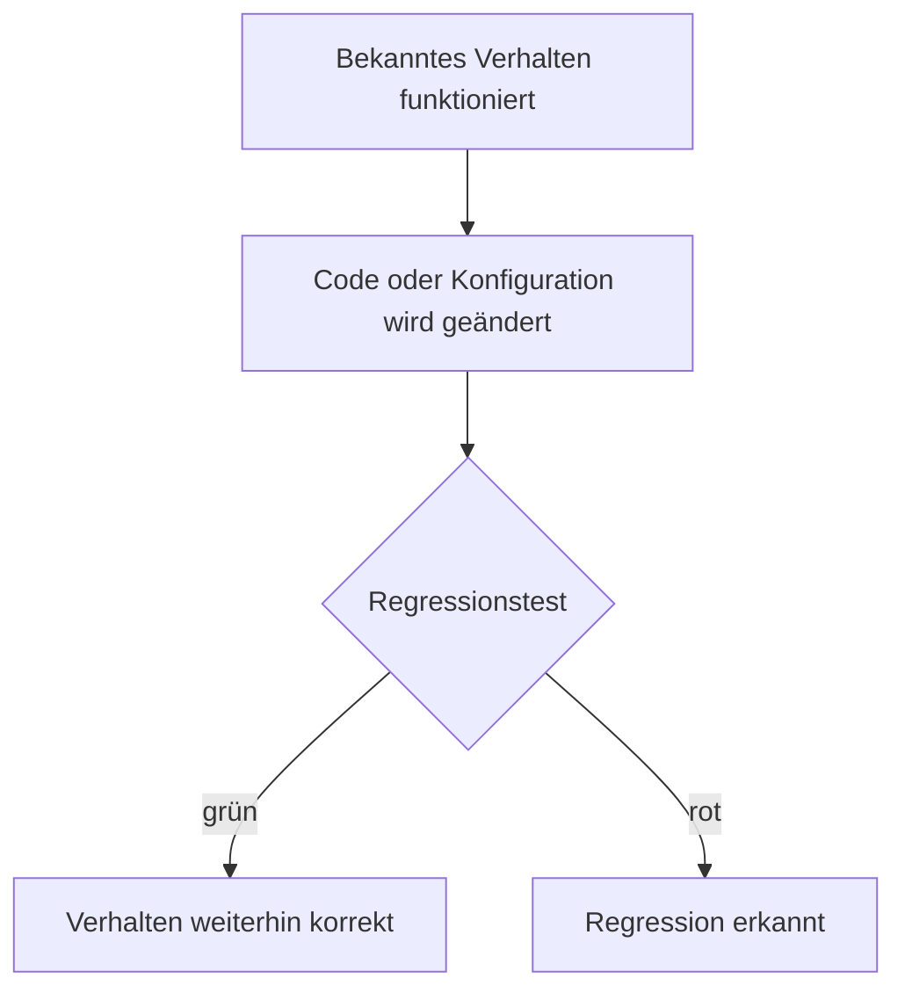
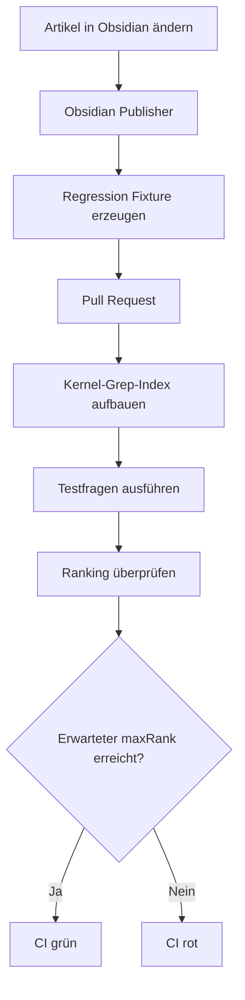
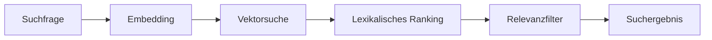
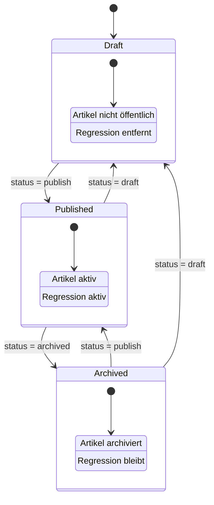

Bei Tests denkt man schnell an die Frage:

> Funktioniert mein neuer Code?

Ein **Regressionstest** stellt aber noch eine zweite, mindestens genauso wichtige Frage:

> Funktioniert das, was vorher funktioniert hat, danach immer noch?

Genau darum geht es bei Regressionstests.

Ich nutze sie mittlerweile auch in diesem Blog. Besonders interessant wird das bei meiner semantischen Suche **Kernel Grep**, weil sich dort das Verhalten nicht so einfach mit einem klassischen `true` oder `false` überprüfen lässt.

## Das eigentliche Problem

Angenommen, meine Suche liefert für:

```text
Wie kann ich Dwarf Fortress im Browser spielen?
```

den Artikel:

```text
Dwarf Fortress im Browser – mit Proxmox, Authentik und Cloudflare Zero Trust
```

Das ist das Ergebnis, das ich erwarte.

Jetzt ändere ich später etwas:

- das Embedding-Modell
- die Chunk-Größe
- das Ranking
- die Gewichtung von semantischer und klassischer Suche
- die Texte eines Artikels
- die Indexierung

Die Anwendung startet danach vielleicht weiterhin problemlos.

Alle Unit-Tests sind grün.

Aber plötzlich landet der Dwarf-Fortress-Artikel bei derselben Suche nur noch auf Platz 8.

Technisch funktioniert die Suche weiterhin.

Qualitativ ist sie aber schlechter geworden.

Genau so etwas soll ein Regressionstest erkennen.

## Regression bedeutet nicht automatisch Fehler

Der Name kommt daher, dass wir eine **Regression** erkennen wollen.

Also vereinfacht:



Ein Regressionstest hält bekanntes Verhalten fest und überprüft es nach zukünftigen Änderungen erneut.

Ein einfaches Beispiel wäre:

```js
expect(add(2, 2)).toBe(4);
```

Wenn ich später die Implementierung von `add()` ändere und plötzlich `5` herauskommt, erkennt der Test die Regression.

Bei einer semantischen Suche ist das schwieriger.

Dort teste ich nicht unbedingt:

```text
Ergebnis = exakt X
```

sondern eher:

```text
Artikel X muss unter den ersten N Ergebnissen auftauchen.
```

## So mache ich das bei Kernel Grep

Für Artikel kann ich direkt im Frontmatter Testfragen hinterlegen.

Zum Beispiel:

```yaml
search_queries:
- query: "Wie kann ich Dwarf Fortress im Browser spielen?"
  maxRank: 1

- query: "Wie funktioniert Dwarf Fortress mit Proxmox?"
  maxRank: 3
```

Damit beschreibe ich meine Erwartung.

Die erste Frage bedeutet:

```text
Der Artikel muss auf Platz 1 landen.
```

Die zweite:

```text
Der Artikel muss mindestens unter den ersten 3 Ergebnissen sein.
```

Das ist deutlich sinnvoller, als nur nach dem Artikeltitel zu suchen.

Denn ein Nutzer wird wahrscheinlich nicht eingeben:

```text
Dwarf Fortress im Browser – mit Proxmox, Authentik und Cloudflare Zero Trust
```

Er fragt eher:

```text
Wie kann ich Dwarf Fortress im Browser spielen?
```

oder:

```text
Kann ich Dwarf Fortress über Proxmox streamen?
```

Genau diese realistischen Fragen möchte ich testen.

## Was bedeutet `maxRank`?

Nehmen wir diesen Test:

```yaml
- query: "Wie teste ich eine semantische Suche?"
  maxRank: 3
```

Kernel Grep könnte beispielsweise liefern:

```text
1. Semantische Suche für meinen Blog
2. Wie dieser Blog gebaut ist
3. Regressionstests – was sie sind und wie ich sie nutze
```

Der Test ist noch erfolgreich.

Mein Artikel befindet sich auf Position 3 und damit innerhalb von:

```text
maxRank: 3
```

Landet er dagegen auf Position 4, wird der Regressionstest rot.

Das ist ein Signal:

```text
Irgendetwas hat das Suchverhalten verändert.
```

Nicht jede Veränderung ist automatisch ein Bug. Aber sie muss zumindest bewusst geprüft werden.

## Die Tests laufen automatisch

Ich möchte nicht bei jedem Artikel zusätzlich irgendwelche JSON-Dateien von Hand pflegen.

Deshalb übernimmt mein Obsidian-Publisher das.

Aus:

```yaml
search_queries:
- query: "Was ist ein Regressionstest?"
  maxRank: 1
```

wird intern ein Regression-Fixture für den Artikel.

Vereinfacht sieht das so aus:

```json
{
  "post": "2026-08-25-regressionstests-was-sie-sind-und-wie-ich-sie-nutze",
  "queries": [
    {
      "query": "Was ist ein Regressionstest?",
      "maxRank": 1
    }
  ]
}
```

Diese Dateien liegen bei mir unter:

```text
rag/regression/cases/
```

Beim Pull Request läuft dann die CI dagegen.

Das Prinzip ist:



Damit wird die Suchqualität Teil meiner normalen CI.

## Warum reicht ein Unit-Test nicht?

Unit-Tests und Regressionstests überschneiden sich durchaus.

Sie verfolgen aber oft einen anderen Blickwinkel.

Ein Unit-Test könnte beispielsweise prüfen:

```text
Berechnet cosineSimilarity() den richtigen Wert?
```

Oder:

```text
Kann ein Artikel korrekt in Chunks zerlegt werden?
```

Das sind wichtige Tests.

Aber alle diese Komponenten können einzeln korrekt funktionieren und gemeinsam trotzdem schlechtere Suchergebnisse erzeugen.

Der Regressionstest schaut deshalb auf das Verhalten des Gesamtsystems.



Er prüft eher:

> Kommt am Ende weiterhin das heraus, was ich erwarte?

## Ein Fehler, den ich selbst gemacht habe

Anfangs hatte nicht jeder Artikel ein Regression-Fixture.

Die CI prüfte korrekt:

```text
Every active post needs a search regression fixture.
```

Danach lief aber ein weiterer Test weiter und versuchte:

```js
fixture.queries
```

auf einem nicht vorhandenen Fixture aufzurufen.

Das Resultat war zusätzlich:

```text
Cannot read properties of undefined
```

Damit hatte ich plötzlich zwei Fehler.

Der erste war sinnvoll:

```text
Regression-Fixture fehlt.
```

Der zweite war nur ein Folgefehler.

Deshalb prüft der Test heute sinngemäß:

```js
const fixture = fixtures.get(slug);

if (!fixture) {
  continue;
}
```

Der eigentliche Coverage-Test bleibt trotzdem rot.

Damit bekomme ich einen klaren Fehler statt einer Kaskade aus Folgefehlern.

## Was passiert bei neuen Artikeln?

Neue Artikel bekommen automatisch ein Regression-Fixture.

Wenn ich keine eigenen Fragen angebe, kann zunächst der Artikeltitel als einfacher Test verwendet werden.

Besser sind aber echte Fragen:

```yaml
search_queries:
- query: "Was ist ein Regressionstest?"
  maxRank: 1
- query: "Wofür brauche ich Regressionstests?"
  maxRank: 3
```

Damit teste ich nicht nur, ob die Suchmaschine Wörter aus dem Titel wiederfindet, sondern ob sie die **Bedeutung** einer Frage dem richtigen Artikel zuordnen kann.

## Was passiert beim Archivieren oder Löschen?

Auch der Lifecycle eines Artikels gehört dazu.

Bei:

```yaml
status: draft
```

wird der Artikel nicht mehr veröffentlicht und sein Regression-Fixture entfernt.

Bei:

```yaml
status: archived
```

bleibt der Artikel Teil der Historie und der Regressionstest kann erhalten bleiben.



## Fazit

Ein Regressionstest beantwortet im Kern eine einfache Frage:

> Funktioniert das, was bisher funktioniert hat, nach meiner Änderung immer noch?

Bei klassischem Code kann das ein konkreter Rückgabewert sein.

Bei meiner semantischen Suche ist es ein erwartetes Suchergebnis.

Mit:

```yaml
search_queries:
- query: "Was ist ein Regressionstest?"
  maxRank: 1
```

kann ich diese Erwartung direkt beim Artikel dokumentieren.

Der Obsidian-Publisher übernimmt daraus den technischen Test und die CI führt ihn automatisch aus.

Damit wird aus:

```text
Ich glaube, die Suche funktioniert noch.
```

ein:

```text
Ich habe geprüft, dass die bekannten Suchfälle weiterhin funktionieren.
```

Und genau dafür sind Regressionstests ziemlich praktisch.

## Querverweise

- [[kernel-grep-semantische-suche-fuer-meinen-blog|Kernel Grep – semantische Suche für meinen Blog]]
- [[wie-dieser-blog-gebaut-ist|Wie dieser Blog gebaut ist]]
- [[markdown-features-im-blog|Markdown-Features im Blog nutzen]]

## Quellen

- [GitHub Actions Dokumentation](/sources.html#github-actions-docs)
- [multilingual-e5-small Model Card](/sources.html#e5-multilingual-small)
- [Transformers.js Dokumentation](/sources.html#transformers-js)
- [DuckDB Node.js Client](/sources.html#duckdb-node-neo)
