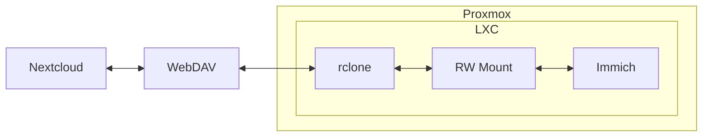
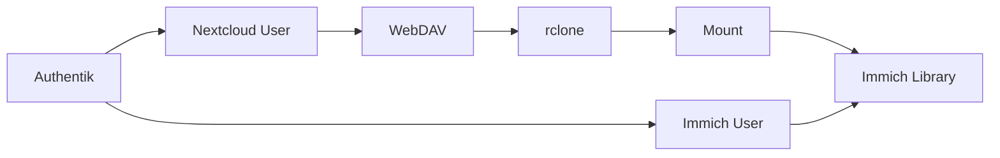
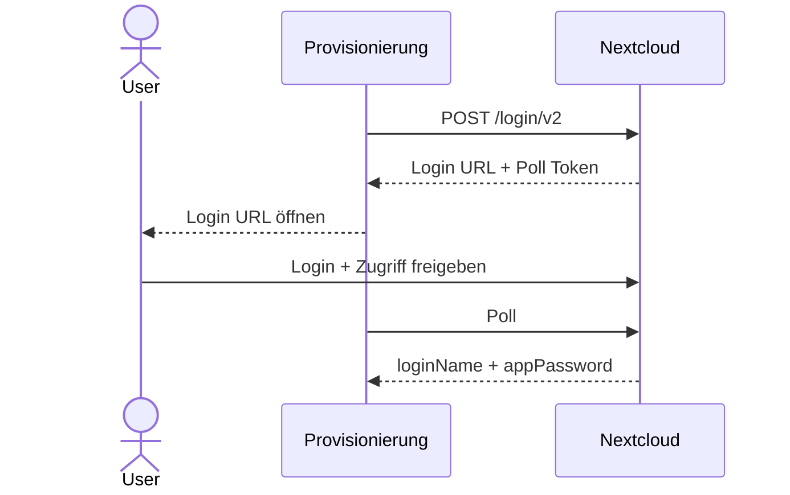

Meine Fotos liegen bereits in **Nextcloud**. Für die eigentliche Verwaltung gefällt mir **Immich** aber deutlich besser.

Also alles rüberkopieren? Nein. Dann hätte ich denselben Fotobestand zweimal und dürfte irgendwann Sync-Konflikte debuggen.

Mein Weg ist einfacher:

```text
Nextcloud
    ↓ WebDAV
rclone mount
    ↓
Immich
```

Keine zweite Kopie. Immich arbeitet direkt mit den vorhandenen Dateien.

## Der Aufbau

Immich läuft bei mir in einem **LXC auf Proxmox**. Im LXC mountet rclone die jeweiligen Nextcloud-Verzeichnisse.



WebDAV und rclone sind dabei **nicht zwei Sync-Lösungen**:

- WebDAV ist die Schnittstelle von Nextcloud.
- rclone ist der Client und macht daraus einen Mount.
- Immich sieht am Ende nur einen normalen Pfad.

Zum Beispiel:

```text
/mnt/nextcloud/user-a/photos
```

`rsync` brauche ich dafür nicht. Das würde wieder Dateien kopieren und damit genau den zweiten Datenbestand erzeugen, den ich vermeiden will.

## Bewusst read-write

Meine Fotoordner sind **RW** eingebunden. Immich darf also Änderungen zurückschreiben.

Das ist unter anderem für XMP-Sidecars relevant:

```text
IMG_1234.jpg
IMG_1234.jpg.xmp
```

Immich verändert dabei nicht zwingend das Originalbild, aber sehr wohl den Datenbestand. Bei einem RW-Mount können auch Löschungen bis zur Originaldatei durchgereicht werden.

Das ist gewollt – macht eine korrekte Benutzerzuordnung aber umso wichtiger.

## Das eigentliche Problem: Provisionierung

Mit einem Benutzer wäre der Aufbau schnell erledigt. Mit mehreren brauche ich pro Person eine eindeutige Kette:

```text
Nextcloud User
    ↓
WebDAV Credential
    ↓
rclone Remote
    ↓
Mount
    ↓
Immich External Library
```

Und diese Library muss natürlich beim richtigen Immich-Benutzer landen.



Authentik und OIDC lösen nur die Frage **„Wer bist du?“**. Sie erzeugen mir weder den WebDAV-Zugang noch den Mount oder die passende External Library.

Genau dafür brauche ich die Provisionierung.

## Nextcloud-Zugang ohne Benutzerpasswort

Für rclone möchte ich nicht das normale Nextcloud-Passwort speichern.

Nextcloud bietet dafür den **Login Flow v2**. Die Provisionierung startet den Flow, der Benutzer bestätigt den Zugriff im Browser und erhält für den Client ein eigenes App-Passwort.



Das ist nicht komplett headless, aber das eigentliche Benutzerpasswort muss nirgends in meiner rclone-Konfiguration landen.

Danach kann die Provisionierung das Remote und den Mount anlegen:

```ini
[nextcloud-user-a]
type = webdav
url = https://cloud.obivan.org/remote.php/dav/files/user-a/
vendor = nextcloud
user = user-a
pass = <app-password>
```

Daraus wird beispielsweise:

```text
/mnt/nextcloud/user-a
```

und daraus wiederum die External Library für genau diesen Immich-Benutzer.

## Wo ich zuerst falsch lag

Ein paar Annahmen waren zu einfach:

- **External Library heißt nicht read-only.** Meine Mounts sind bewusst RW; Immich kann XMP schreiben und Dateien löschen.
- **WebDAV + rclone sind keine doppelte Synchronisation.** WebDAV ist das Protokoll, rclone der Mount-Client.
- **OIDC ist keine Provisionierung.** Login und Storage-Zuordnung sind zwei verschiedene Probleme.
- **Login Flow v2 ist nicht vollständig headless.** Der Benutzer muss den Zugriff einmal im Browser freigeben.

Gerade der letzte Punkt ist für die Automatisierung wichtig: Ich kann fast alles provisionieren, aber nicht sinnvoll so tun, als gäbe es den Benutzer dabei gar nicht.

## Der kritische Teil ist das Mapping

Ich möchte keine Zuordnung über Display Names oder irgendwelche String-Tricks bauen.

Stattdessen brauche ich stabile IDs, zum Beispiel:

```yaml
authentik_id: abc123
nextcloud_id: user-a
immich_id: 89c0...
storage_alias: user-a
```

Denn das hier darf bei einem RW-Mount niemals passieren:

```text
Immich User A
        ↓
/mnt/nextcloud/user-b
```

Das wäre nicht nur ein Datenschutzproblem. Immich könnte im falschen Bestand auch Änderungen auslösen.

## Fazit

Ich synchronisiere Nextcloud und Immich nicht. Ich **verbinde** sie.

```text
Nextcloud
    ↓ WebDAV
rclone mount
    ↓
Immich
```

WebDAV und rclone lösen den Datenzugriff. Die spannendere Baustelle ist die Provisionierung: Benutzer erkennen, App-Zugang erzeugen, Mount anlegen und die richtige Immich-Library zuordnen.

Keine zweite Fotosammlung. Kein rsync. Und möglichst kein manueller Mount-Zirkus pro Benutzer.

## Querverweise

- [[deployment-mit-hetzner-docker-und-cloudflare-zero-trust|Deployment mit Hetzner, Docker und Cloudflare Zero Trust]]
- [[docker-vs-docker-compose|Docker vs. Docker Compose]]

## Quellen

- [Immich External Libraries](/sources.html#immich-external-libraries)
- [Immich XMP Sidecars](/sources.html#immich-xmp-sidecars)
- [Immich FAQ](/sources.html#immich-faq)
- [Nextcloud Login Flow v2](/sources.html#nextcloud-login-flow)
- [rclone WebDAV](/sources.html#rclone-webdav)
- [rclone mount](/sources.html#rclone-mount)
- [Authentik Integration mit Immich](/sources.html#authentik-immich)
