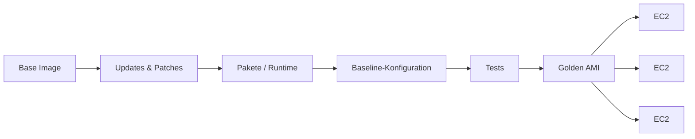
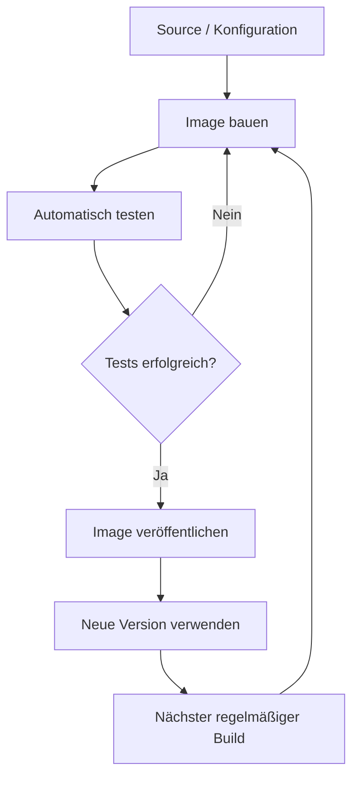

Server von Hand aufzusetzen funktioniert erstaunlich lange.

Ein Paket hier, eine Konfigurationsdatei dort, noch schnell Java installieren, einen Agent ergänzen und anschließend hoffen, dass man beim nächsten Server noch weiß, was man eigentlich gemacht hat.

Spätestens beim dritten nahezu identischen System wird daraus weniger Administration und mehr Archäologie.

Genau hier kommen **Golden Images** ins Spiel.

## Was ist überhaupt ein Golden Image?

Im AWS-Kontext ist das häufig ein vorbereitetes **AMI** – also ein Maschinenabbild, aus dem neue EC2-Instanzen gestartet werden.

Darin kann bereits alles enthalten sein, was auf praktisch jeder Instanz benötigt wird:

```text
Betriebssystem
+ Updates
+ Runtime
+ grundlegende Konfiguration
+ Monitoring / Security Agent
+ eigene Baseline
= Golden Image
```

Statt bei jedem Start dieselben Schritte erneut auszuführen, beginne ich mit einem definierten Ausgangspunkt.

Das macht den Aufbau einer Instanz deutlich vorhersehbarer.



## Der eigentliche Vorteil ist nicht Geschwindigkeit

Natürlich startet eine vorbereitete Maschine schneller als eine Instanz, die nach dem Boot erst dutzende Pakete installieren muss.

Für mich ist der wichtigere Punkt aber **Reproduzierbarkeit**.

Wenn drei Instanzen aus demselben getesteten Image entstanden sind, ist ihr Ausgangszustand weitgehend bekannt. Ich muss nicht mehr hoffen, dass ein Installationsskript auf allen drei Maschinen exakt gleich durchgelaufen ist.

Das hilft auch bei Fehlern. Statt zu fragen:

> Was wurde auf diesem einen Server irgendwann einmal manuell geändert?

kann ich eher fragen:

> Aus welcher Image-Version wurde die Instanz gestartet?

Das ist ein deutlich angenehmeres Problem.

## Ein Golden Image ist kein Haustier

Der Name klingt allerdings gefährlich endgültig.

**Golden** hört sich ein bisschen nach „fertig, geprüft, für immer gut“ an.

Genau das ist ein Image natürlich nicht.

Pakete bekommen Sicherheitsupdates, Zertifikate laufen aus, Agent-Versionen ändern sich und aus einem heute sauberen Image wird irgendwann ein ziemlich altes Museumsexponat.

Darum sollte ein Golden Image eher als **Artefakt einer Pipeline** verstanden werden und nicht als Datei, die einmal gebaut und anschließend jahrelang verwendet wird.



## Was ich möglichst nicht in ein Image packen würde

Ein Golden Image sollte eine **Baseline** sein – keine eingefrorene Produktionsumgebung.

Secrets, Passwörter, umgebungsspezifische Zugangsdaten oder fest verdrahtete Hostnamen gehören dort nicht hinein. Auch Daten, die sich je Umgebung unterscheiden, möchte ich möglichst erst beim Deployment oder beim Start der Instanz setzen.

Das Image beantwortet für mich eher die Frage:

> Wie sieht ein sauber vorbereiteter Server grundsätzlich aus?

Nicht:

> Wie sieht exakt diese eine Produktionsinstanz aus?

## Image statt Installationsskript?

Ganz ersetzen sich beide Ansätze nicht.

Ein schlankes Bootstrap-Skript oder User Data ist weiterhin praktisch für Dinge, die erst beim Start bekannt sind: Umgebung, Instanzrolle, Konfiguration oder aktuelle Deployment-Artefakte.

Ich trenne deshalb gerne grob zwischen **Build Time** und **Boot Time**.

| Build Time – ins Image | Boot Time – beim Start |
| --- | --- |
| OS-Patches | Umgebungsabhängige Konfiguration |
| Java / Runtime | aktuelle Anwendungsversion |
| Standardpakete | Secrets über einen sicheren Store |
| Monitoring-Basis | Registrierung bei Services |
| Security-Baseline | instanzspezifische Werte |

Je mehr stabile Arbeit bereits beim Image-Build erledigt wird, desto weniger kann beim Boot überraschend fehlschlagen.

## Testen gehört zum Image dazu

Nur weil ein Image erfolgreich gebaut wurde, heißt das noch nicht, dass ich damit einen funktionierenden Server starten kann.

Darum sollte der Build idealerweise auch prüfen, ob die wichtigsten Erwartungen tatsächlich erfüllt sind.

Zum Beispiel:

```bash
java -version
systemctl is-enabled amazon-ssm-agent
```

Oder noch besser: Eine temporäre Instanz aus dem neuen AMI starten, Smoke Tests ausführen und das Image erst danach freigeben.

Damit wird aus „wir haben ein Image gebaut“ langsam eine echte **Image Pipeline**.

## Und wie kommt das Image auf die EC2?

Hier gefällt mir die Kombination mit **Launch Templates** besonders gut.

Ein Launch Template beschreibt unter anderem, welches AMI beim Start verwendet werden soll. Eine neue getestete Golden-Image-Version kann damit gezielt in eine neue Template-Version übernommen werden.


Das ist deutlich sauberer, als irgendwo manuell eine AMI-ID auszutauschen und anschließend nicht mehr zu wissen, welche Instanzen auf welchem Stand laufen.

## Immutable statt reparieren

Der Gedanke hinter Golden Images passt außerdem gut zu **Immutable Infrastructure**.

Wenn eine Instanz kaputtkonfiguriert ist, möchte ich sie nach Möglichkeit nicht stundenlang wieder gesundpflegen. Ich möchte sie ersetzen.

Neues Image bauen, testen, neue Instanz starten, alte Instanz entfernen.

Das funktioniert natürlich nicht für jede Workload gleich gut. Zustandsbehaftete Systeme brauchen mehr Planung. Aber gerade bei austauschbaren Application Servern ist dieser Ansatz angenehm unspektakulär.

## Fazit

Golden Images lösen nicht automatisch alle Serverprobleme. Ein ungepflegtes Golden Image ist am Ende nur ein sehr reproduzierbarer alter Server.

Richtig interessant werden sie erst zusammen mit Automatisierung:

**bauen → patchen → testen → versionieren → verteilen → regelmäßig wiederholen.**

Dann wird aus einem AMI mehr als nur eine Vorlage für EC2.

Es wird ein definierter, überprüfbarer Ausgangspunkt für Infrastruktur.

Und damit darf das Gold dann ruhig ein bisschen glänzen.
