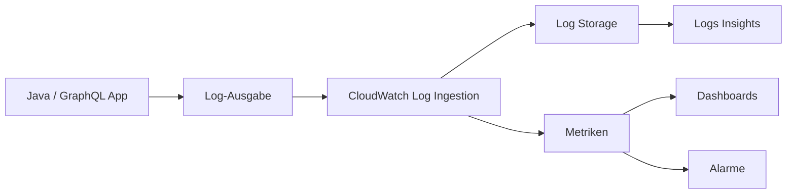
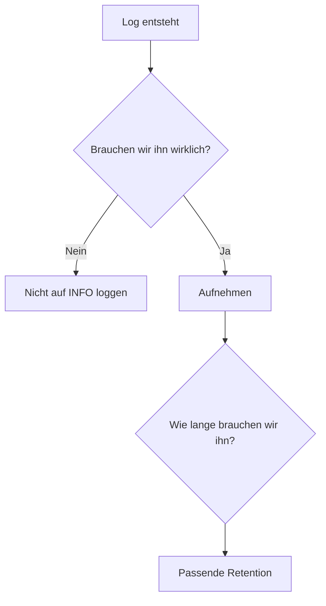

Logs fühlen sich erstmal kostenlos an.

```java
logger.info("Loading user {}", userId);
```

Eine Zeile mehr. Was soll schon passieren?

In einer lokalen Anwendung: wahrscheinlich gar nichts. In einer produktiven Umgebung sieht die Rechnung aber anders aus. Die Meldung wird erzeugt, übertragen, von einer Logging-Plattform aufgenommen, gespeichert und irgendwann vielleicht noch durchsucht oder ausgewertet.

Bei AWS CloudWatch kommt deshalb nicht nur die Aufbewahrung ins Spiel. Auch **Log Ingestion, Metriken, Dashboards, Alarme und Abfragen** gehören zur Observability-Rechnung.

Ein einzelnes `logger.info()` ist dabei nicht das Problem. Die **Aufruffrequenz** ist es.

## Von einer Log-Zeile zur Datenmenge

Nehmen wir ein Java-Backend mit GraphQL. Ein Resolver schreibt bei jedem Aufruf eine harmlose Meldung:

```java
logger.info("Resolving user {}", userId);
```

Dazu kommt eine GraphQL-Abfrage:

```graphql
query {
  employees {
    id
    name
    department {
      name
    }
  }
}
```

Ein GraphQL-Request kann mehrere Resolver auslösen. Wenn jeder Resolver ein paar `INFO`-Zeilen produziert, wird aus einem Request schnell eine ganze Reihe von Logs.

```text
1 GraphQL Request
× mehrere Resolver
× mehrere Log-Zeilen
× viele Requests
× 24 Stunden
× 30 Tage
```

Und plötzlich reden wir nicht mehr über eine einzelne Textzeile.

## Wo das Geld eigentlich entsteht

Der Weg eines Logs ist länger, als man beim Schreiben von `logger.info()` denkt:



Das Interessante dabei: **Speicherplatz ist nicht automatisch der wichtigste Kostenpunkt.** Je nach Umgebung kann bereits die Menge der permanent aufgenommenen Daten deutlich relevanter sein.

Das verändert die Frage von:

> Wie lange behalten wir unsere Logs?

zu:

> Müssen wir diese Information überhaupt bei jedem Request erzeugen?

Retention bleibt wichtig. Aber Daten, die gar nicht erst unnötig erzeugt werden, müssen weder aufgenommen noch gespeichert werden.

## Mehr Logs sind nicht automatisch bessere Observability

Das Ziel sollte natürlich nicht sein, möglichst wenig zu loggen. Ohne vernünftige Logs wird aus einem Produktionsfehler sehr schnell Archäologie.

Aber es gibt einen Unterschied zwischen einer Information, die mir bei der Fehlersuche hilft, und einer Information, die lediglich beweist, dass irgendeine Methode aufgerufen wurde.

So etwas kann sinnvoll sein:

```text
ERROR Payment failed for order 4711
```

Bei diesen Meldungen würde ich dagegen zumindest über das Log-Level nachdenken:

```text
INFO Entering getUser()
INFO User object created
INFO Leaving getUser()
```

Solche Details können beim Debugging nützlich sein. Im normalen Produktionsbetrieb gehören sie aber häufig eher nach `DEBUG` oder `TRACE`.

Noch interessanter wird es bei kompletten Request- und Response-Bodies. Ein hübsch formatiertes JSON kann schnell mehrere Kilobyte groß sein. Wird es bei jedem Request geloggt, multipliziert sich die Datenmenge entsprechend.

Und neben den Kosten entsteht ein zweites Problem: **Rauschen**.

Wenn zehntausende irrelevante Zeilen produziert werden, wird die eine relevante Meldung im Fehlerfall nicht leichter zu finden.

## Drei Fragen vor dem nächsten `logger.info()`

Ich versuche mir deshalb bei neuen Logs drei einfache Fragen zu stellen:

1. **Hilft mir diese Information bei einem echten Problem?**
2. **Wie häufig kann diese Zeile produziert werden?**
3. **Ist `INFO` wirklich das richtige Level?**

Gerade die zweite Frage wird gerne vergessen. Eine Log-Zeile in einem selten ausgeführten Admin-Job ist etwas völlig anderes als dieselbe Zeile in einem Resolver oder Request-Pfad, der tausendfach pro Minute ausgeführt wird.

Das Prinzip gilt nicht nur für Application Logs. Auch bei Dingen wie VPC Flow Logs, eigenen Metriken oder Dashboards lohnt sich gelegentlich die Frage: **Nutzen wir diese Daten tatsächlich noch?**

## Retention löst nicht alles

Eine sinnvolle Retention Policy gehört trotzdem dazu. Nicht jedes Log muss für immer aufgehoben werden.

Je nach Anwendungsfall können beispielsweise kurze Zeiträume für technische Debug-Logs reichen, während Audit- oder Security-Daten deutlich länger benötigt werden.

Aber Retention behandelt nur Daten, die bereits entstanden sind.



Für mich ist deshalb die Reihenfolge wichtig: **erst Relevanz, dann Retention.**

## Fazit

Observability ist Infrastruktur. Und Infrastruktur hat ein Preisschild.

Das bedeutet nicht, dass wir aus Angst vor Kosten auf Logs, Metriken oder Alarme verzichten sollten. Im Gegenteil: Gute Observability spart im Fehlerfall oft sehr viel mehr Zeit und Geld, als sie kostet.

Aber „mehr“ ist nicht automatisch „besser“.

Ein zusätzliches `logger.info()` wird niemanden arm machen. Ein `logger.info()` in einem Hot Path wahrscheinlich auch nicht.

**Zwanzig davon, bei jedem Request, in jedem Service, jeden Tag?**

Dann lohnt sich zumindest die Frage, ob wir wirklich alles davon brauchen.
